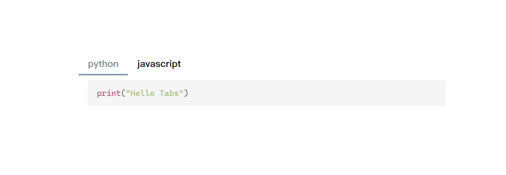
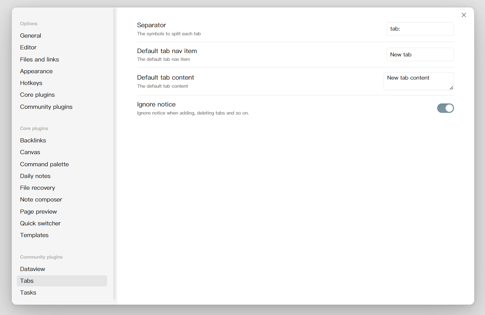

# Obsidian Tabs

Thanks to the [Code Tab](https://github.com/lazyloong/obsidian-code-tab) plugin for the inspiration, but since it had not been updated for a long time and it wasn't support edit content directly, I refactored the plugin and added a lot of features.

## Showcase

Insert a tab component into markdown file.


Nested use tabs.


With Dataview & Tasks


With LeetCode


ps.If you have a usage you'd like to share, feel free to raise an issue or pull a request. I'll add it to readme.

## Usage

### 1. Create a tabs code block

Generate a tab component using the tab code block.

````
```tabs
tab: TAB ONE
Content of TAB ONE

tab: TAB TWO
Content of TAB TWO
```
````

### 2. With other code block

If your tab contents have code block, you need to use more `, like

`````
````tabs
tab: python
```python
print("Hello Tabs")
```

tab: javascript
```javascript
console.log('Hello Tabs');
````
`````




With this feature, you can create tabs component nested.

`````
````tabs
tab: TAB-ONE
An innerTab in TAB-ONE 👇

```tabs
tab: inner tab one
This is an inner tab.

tab: inner tab two
This is an inner tab.
```

tab: TAB-TWO
````
`````


### 3. Edit tab

Double click the content can rouse an editor.


If you want to delete a tab, you can right click the tab and delete it.


If you accidentally delete a tab, you can use `ctrl z` to restore it.

You can quickly create a new tab using the contents of the clipboard.


tip: if tab nav is too long, try to hold `shift` and scroll.

Remember to click the Save button when you are finished editing.

### 4. Command

Provides a command to quickly create or convert selected text to a Tabs component. Click `Cmd-p` to open the setting pannel. Search for 'Tabs'.


### 5. Settings

