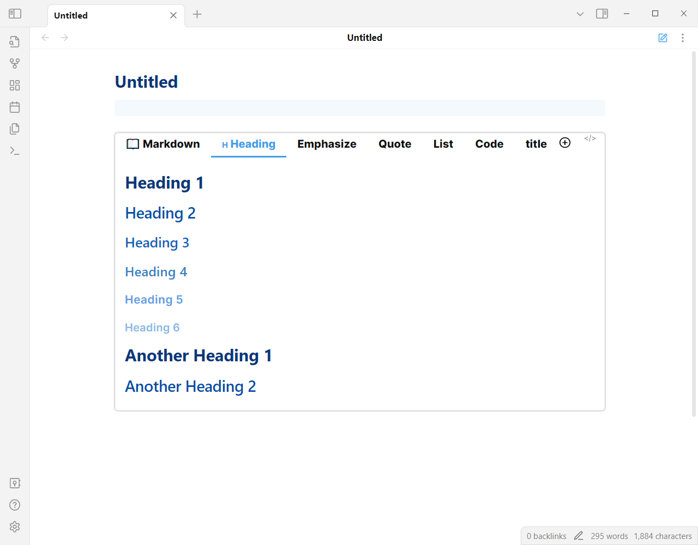

# Obsidian Tabs

Thanks to the [Code Tab](https://github.com/lazyloong/obsidian-code-tab) plugin for the inspiration, but since it had not been updated for a long time and it wasn't support edit content directly, I refactored the plugin and added a lot of features.

## Feature

Insert a tab component into markdown file.




Edit tab content directly. (double click the content)


## Usage

Create a tabs code block

````
```tabs
tab: 📖 Markdown
## What is Markdown?

It’s a plain text format for writing structured documents, based on formatting conventions from email and usenet.

...

tab: 🇭 Heading
# Heading 1

## Heading 2

...

```
````

If your tab contents have code block, you need to use more `, like

`````
````tabs
tab: python

```python
print("Hello Tabs")
```

````
`````

If you want to delete a tab, you can right click the tab and delete it.


If you accidentally delete a tab, you can use `ctrl z` to restore it.

You can quickly create a new tab using the contents of the clipboard.


tip: if tab nav is too long, try to hold `shift` and scroll.

Remember to click the Save button when you are finished editing.
