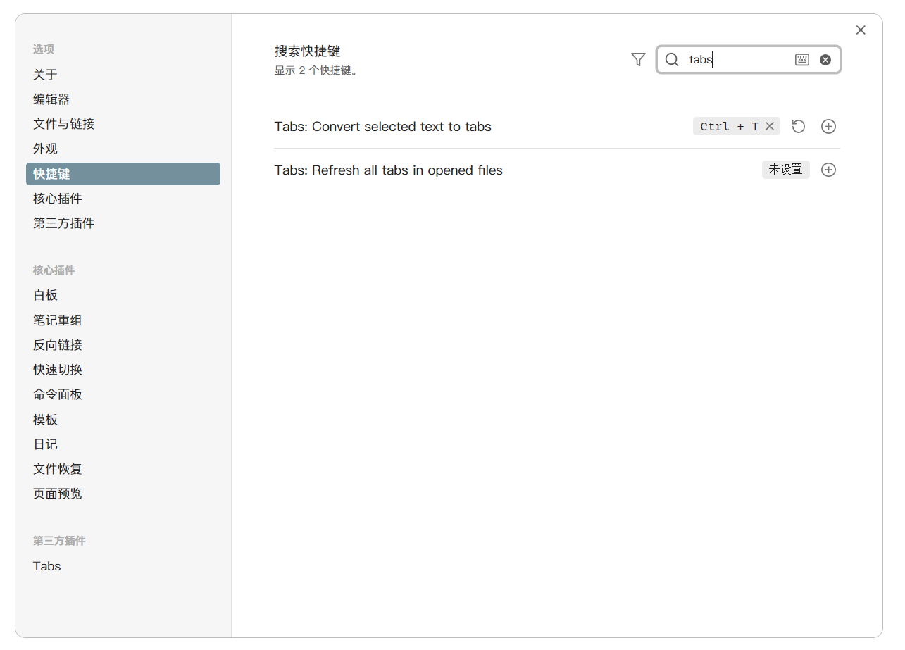

# Commands

Tabs plugin provides two commands that can be accessed through the command palette (ctrl-p) or by adding hotkeys in the settings.

## Tabs: Convert selected text to tabs

When using this command:

- If no text is selected, a new Tabs component will be created at the cursor position
- If text is selected, it will be wrapped with \`\`\`tabs ... \`\`\`. The number of backticks will be determined based on the selected content

## Tabs: Refresh all tabs in opened files

This command refreshes all currently open markdown files. You can use this command after modifying Tabs settings to refresh the page (changes to Tabs settings take effect after re-rendering)
