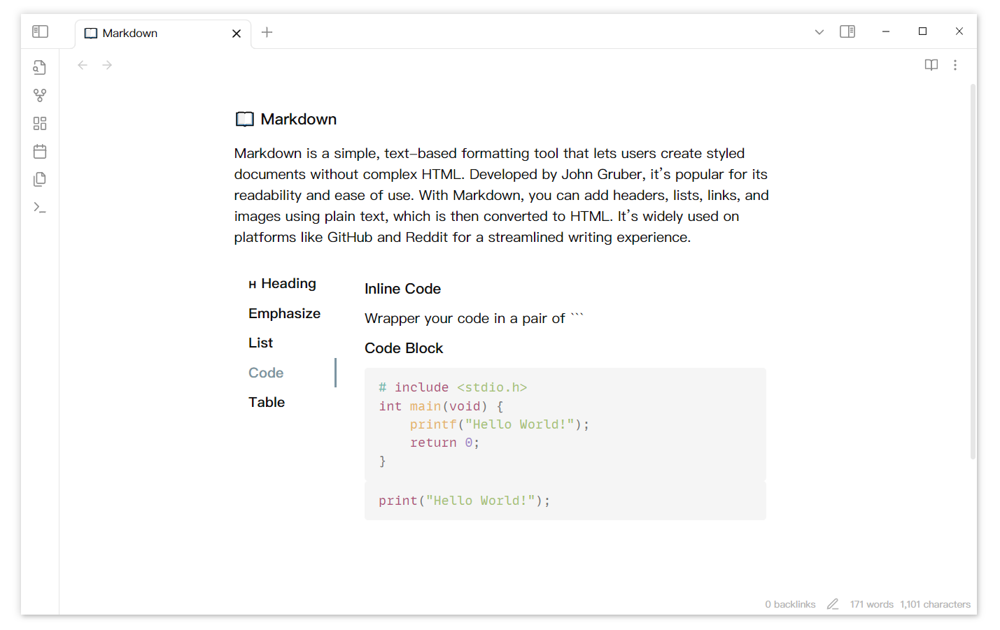

---
---

# 3. Customize your tabs

Add configuration information at the beginning(comma separate). Only the last configuration of the same type takes effect.

````
```tabs
top, multi
tab: TAB 1
Tab content
tab: TAB 2
Tab content
```
````

| Configuration |                  Explanation                  |
| :-----------: | :-------------------------------------------: |
|      top      |  Tabs nav bar will be displayed at the top.   |
|     left      |  Tabs nav bar will be displayed on the left.  |
|     right     | Tabs nav bar will be displayed on the right.  |
|    bottom     | Tabs nav bar will be displayed at the bottom. |
|      one      | Tabs nav bar can scroll with many nav items.  |
|     multi     |    Tabs nav items will show in multi line.    |



You can decorate tab title too.


