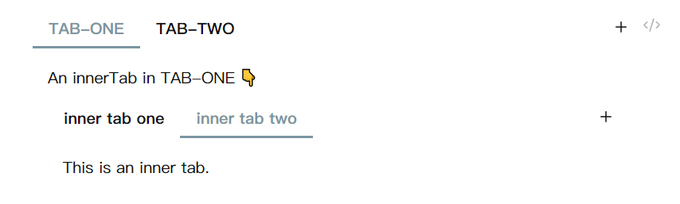

# Creating Tabs Component

> You need to understand [the structure of Tabs](../tabsmodal.md)

The Tabs component is implemented by rendering tabs code blocks. Therefore, you only need to write the following content in any markdown note in Obsidian to create an empty Tabs component.

````md
```tabs

```
````

At this point, the rendered Tabs component has no content added. To optimize the visual effect, I put an empty tab as a placeholder, which is the "New tab" and "New tab content" you can see now.

> You can also use the command [`Tabs: Convert selected text to tabs`](./commands.md#tabs-convert-selected-text-to-tabs) in the command palette to quickly create a Tabs component at the cursor position.

## I. Creating a new tab

Use the `tab: ` keyword to identify a tab.

- The content after `tab: ` is the title, which will be displayed in the nav (note that there's a space after the colon, this keyword can be customized in the [settings](./settings.md))
- The content from the `tab: ` line to the next `tab: ` is the content.

Try copying the following content into your md note:

````md {2-3,5-6}
```tabs
tab: 📺 Music
content in tab 1

tab: 🎵 Movie
content in tab 2
```
````

> [!Warning] Don't write task lists directly in the content
>
> The Tabs plugin is implemented by rendering tabs code blocks, but in Obsidian, text in code blocks is treated as plain text. Therefore, if you write `- [ ] a task` directly in the tabs code block, both the tasks plugin and the dataview plugin will not be able to retrieve them.

In addition to directly editing the tabs code block, you can also:

- Quickly create a new tab by clicking the plus sign at the end of the navigation bar (you need to set Action button to Add new tab in the plugin settings)
- Quickly create a new tab through the menu that appears when right-clicking on the nav

## II. Nested Tabs

You can continue to use tabs code blocks to create Tabs components inside a Tabs component, but you need to ensure that the number of \` or \~ used in the outer layer is more than the number used in the inner layer.

::: details Nested use of code blocks in Markdown

There are two formats for nested use of code blocks in Markdown:

When using only one type of backtick, the outer code block must use more backticks than the inner code block

`````
````tabs
tab: python
```python
print("Hello Tabs")
```

tab: javascript
```javascript
console.log('Hello Tabs');
``
````
`````


When using two types of backticks to generate code blocks, you only need to keep the same type of backtick more in the outer layer than in the inner layer.

````
~~~tabs
tab: python
```python
print("Hello Tabs")
```

tab: javascript
```javascript
console.log('Hello Tabs');
```
~~~
````

:::

::: code-group

`````md [Using only one type of backtick]
````tabs
tab: TAB-ONE
An innerTab in TAB-ONE 👇

```tabs
tab: inner tab one
This is an inner tab.

tab: inner tab two
This is an inner tab.
```

tab: TAB-TWO
...
````
`````

`````md [Using two type of backtick]
````tabs
tab: TAB-ONE
An innerTab in TAB-ONE 👇

```tabs
tab: inner tab one
This is an inner tab.

tab: inner tab two
This is an inner tab.
```

tab: TAB-TWO
...
````
`````

:::



## III. Editing tabs

- You can use the arrow keys to move the cursor into the tabs code block to directly edit the source code of the Tabs component.
- If you have enabled "Double click to edit" in the Tabs plugin settings, you can directly double-click the content to enter the [Tabs editor](./editor.md).
- If you have set "Action button" to "Edit tab", you can enter the Tabs editor by clicking the edit button in the upper right corner of the Tabs component.


