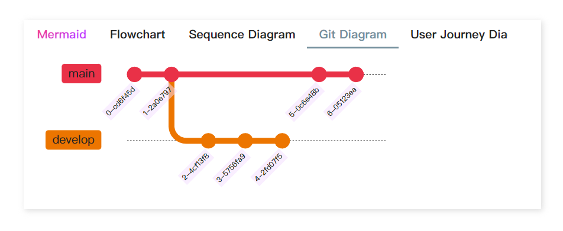
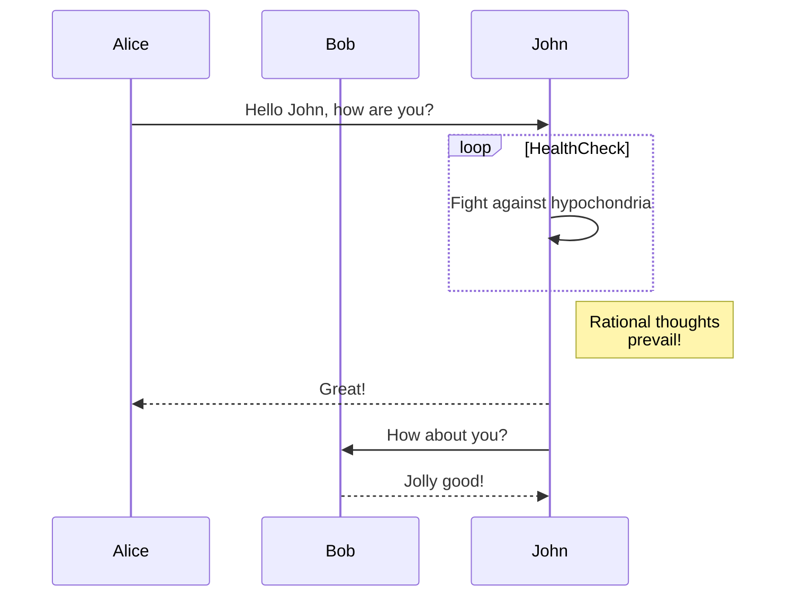
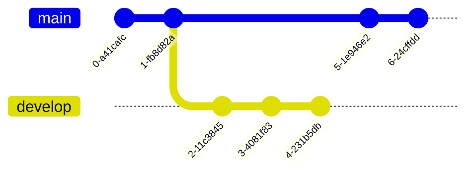
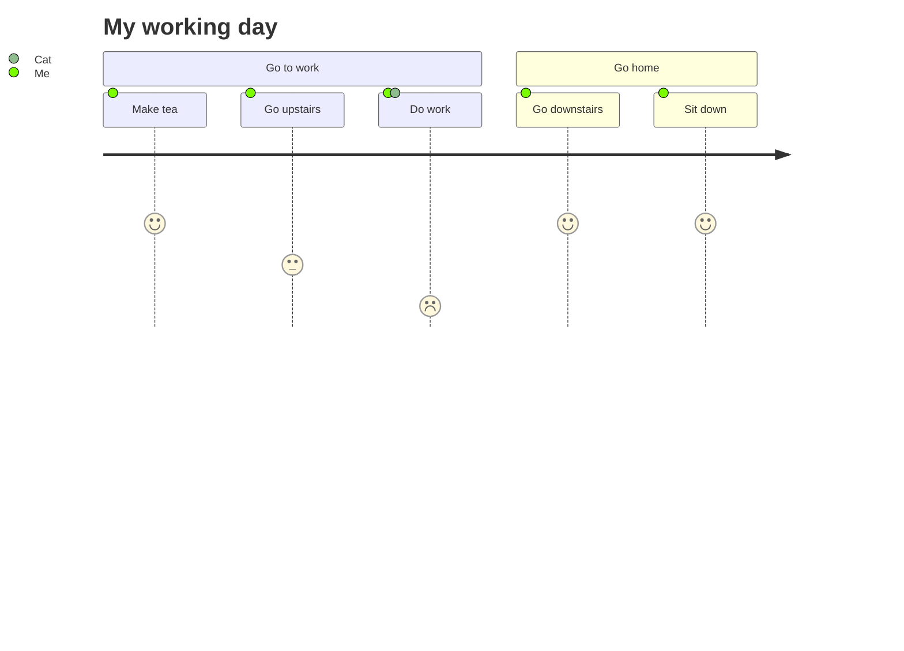
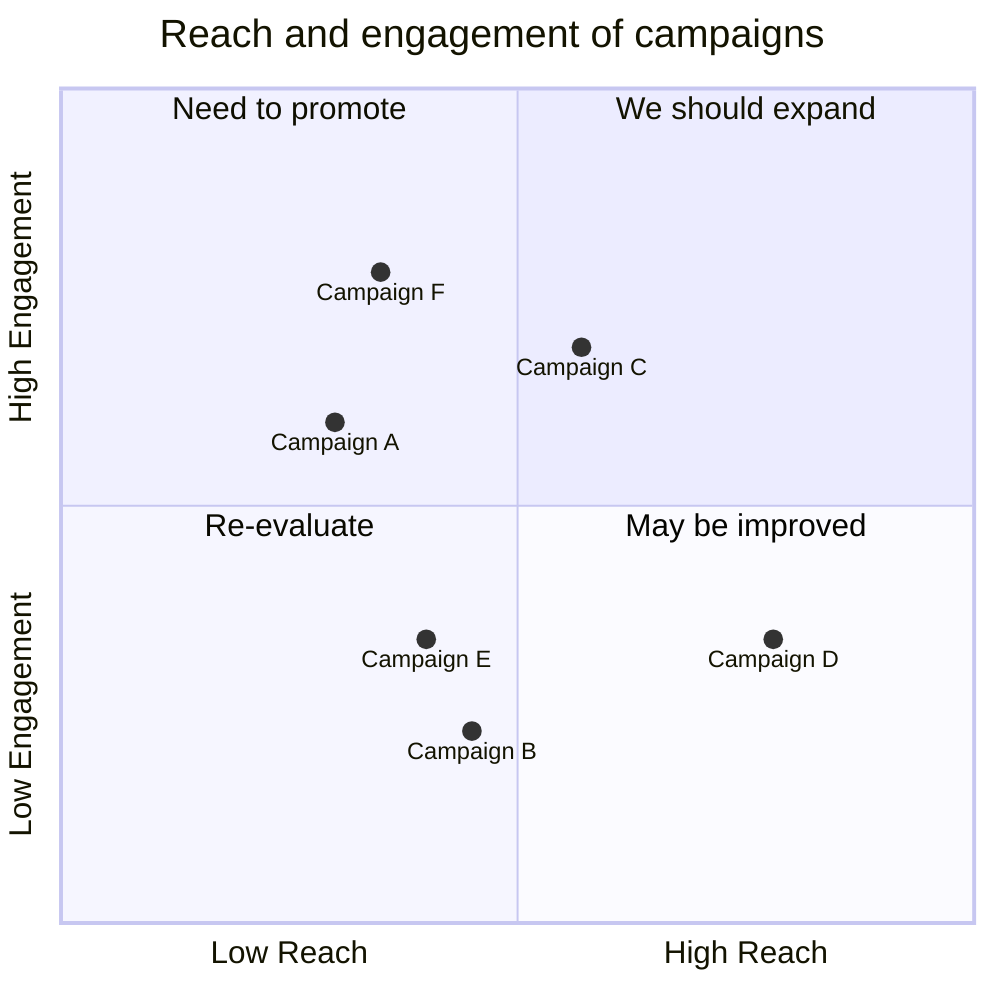
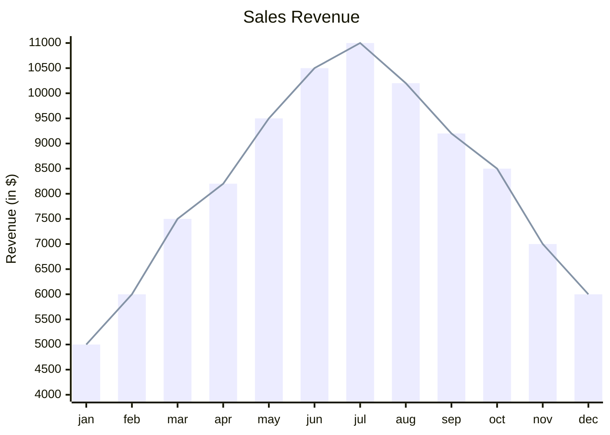

# Using with Other Plugins

Tab content is rendered using [`MarkdownRenderer.render()`](<https://docs.obsidian.md/Reference/TypeScript+API/MarkdownRenderer/render#MarkdownRenderer.render()+method>), which uses Obsidian's reading mode rendering. Therefore, it can be used in combination with many plugins.

::: details Nesting Code Blocks in Markdown

Markdown has two formats for nesting code blocks:

When using only one type of backtick, the outer code block must use more backticks than the inner code block.

`````
````tabs
tab: python
```python
print("Hello Tabs")
```

tab: javascript
```javascript
console.log('Hello Tabs');
````
`````


When using two types of backticks to generate code blocks, only the same type of backtick needs to be used to ensure that the outer code block uses more backticks than the inner code block.

````
~~~tabs
tab: python
```python
print("Hello Tabs")
```

tab: javascript
```javascript
console.log('Hello Tabs');
```
~~~
````

:::

## With Dataview & Tasks


From [DeusEx01](https://github.com/xhuajin/obsidian-tabs/issues/28)

## With mermaid



::: details Source code

`````md
````tabs

tab: <span style="color: transparent; background:-webkit-linear-gradient(120deg, #bd34fe 30%, #ff3670); -webkit-background-clip: text; -webkit-text-fill-color: transparent;">Mermaid</span>
Mermaid allows you to create charts and visualizations using text and code.

It is a chart drawing tool based on JavaScript that renders Markdown-inspired text definitions to dynamically create and modify charts.
tab: Flowchart

tab: Sequence Diagram

tab: Git Diagram

tab: User Journey Diagram

tab: Quadrant Chart

tab: XY Chart

````
`````

:::
