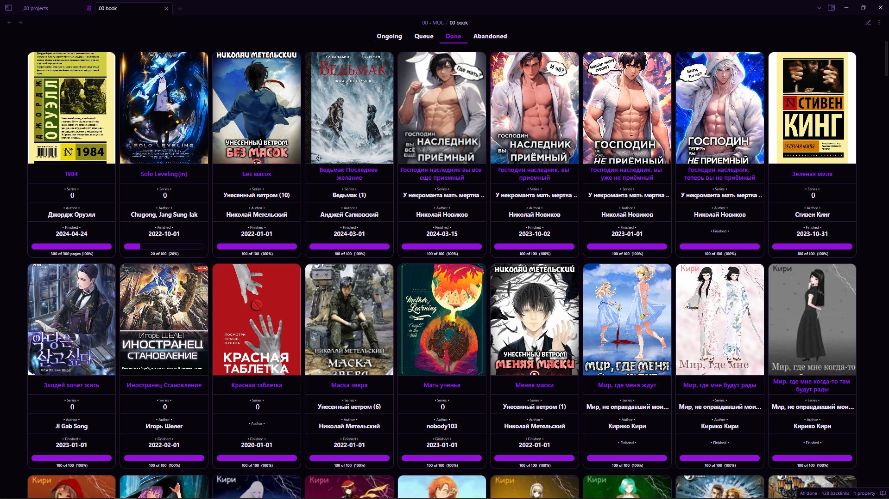
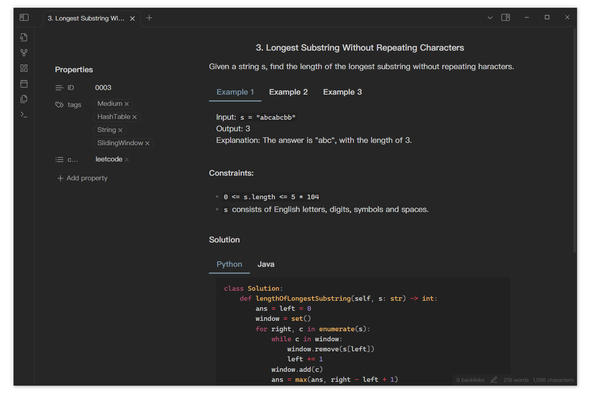

# 示例

如果你想要分享的示例，可以在 [issue](https://github.com/xhuajin/obsidian-tabs/issues/new) 中告诉我，我会添加到此处

From [DeusEx01](https://github.com/xhuajin/obsidian-tabs/issues/28)

With LeetCode

Tabs in mobile, from [DeusEx01](https://github.com/xhuajin/obsidian-tabs/issues/28)

