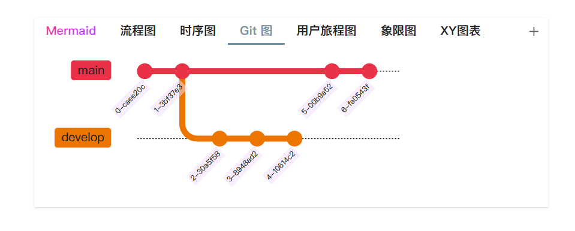

# Obsidian Tabs

<BadgesGroup />

Tabs 插件提供了在 obsidian 笔记中快速渲染一个 Tabs 组件的功能

## 一、Tabs 组件能用来干啥

对我来说，这个插件有两个作用

### (1) 平铺

将线性的笔记平铺，提高对笔记内容的读取效率，对理解大篇幅内容也有帮助。

> 用 ob 的核心插件『大纲』或者使用 floating-toc 之类的插件都可以实现快速查阅的功能。但是我更喜欢这种直接打碎全文，将内容并排展示的方式。原来文中的每个标题都变成了一个标签页，标题与标题之间的递进或者同级的概念也更加清晰。

### (2) 并行

相同层级的内容，可以记录在同一位置，无需上下滑动。

对于同一层级下的同层内容，可以借助嵌套 tab 记录，例如你收集了很多前端 UI 框架，你可以这样使用 Tabs 组件记录他们。

## 二、为什么有 Code tab 还要写 Tabs

如果你给 LeetCode 写过题解，那么你应该见过 LeetCode 的富文本编辑器有一种可切换不同语言的代码块组件，于是我开始找 obsidian 有没有实现这个功能的插件。当时我找到了 [Code Tab](https://github.com/lazyloong/obsidian-code-tab) 插件，非常感谢 lazyloong 大佬写的这个插件。Code tab 的效果很好，但是还缺少一些对我来说比较有用的功能。

::: details

- **无法直接编辑**：每次修改内容都必须编辑源码。内容处于代码块中没有渲染，内容多的时候不好找到要编辑的位置。
- **标签栏位置固定**：标签栏只置于顶端，通过 CSS 修改位置会影响全部组件的样式，无法单独设置某个组件的标签栏置于组件的左侧、右侧或者是底部。
- 新增、删除 tab 时需要编辑源码
- **标签栏顺序固定**：想要修改必须编辑源码，无法拖拽修改 tab 顺序

:::

Code tab 已经长时间没有更新了，因此自己动手丰衣足食，重构插件，添加新功能，Tabs 诞生。

## 三、完成度

已经实现

- 通过简单的语法渲染成 Tabs 组件
- 双击编辑特定 tab
- 快速添加 New tab
- 快速粘贴文本至 Tabs 中
- 快速删除、复制特定 tab
- 自定义 Tabs 配置（导航栏位置、导航栏是否分行）
- 拖拽改变 tab 顺序

尚未实现

- 更多的自定义样式：特定 tab 的标题颜色
- 使用 obsidian 原生实时渲染的 cm5+cm6 编辑器
- 适配 RTL
- 多语言版本设置

