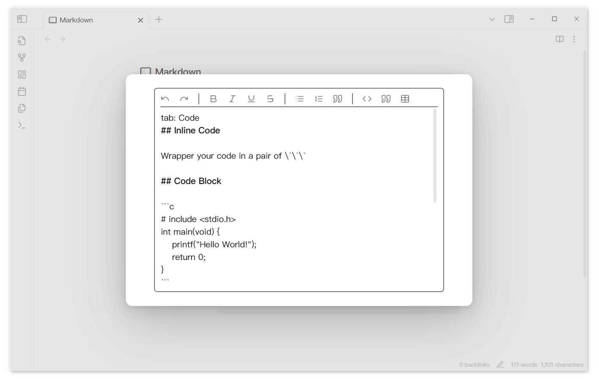

# Tabs 编辑器

为了方便编辑，写了一个简单的 codemirror6 编辑器，你可以通过双击 content 进入 Tabs 编辑器从而快速编辑当前 tab content



## 功能

编辑器目前只实现了一些简单的功能

- 快捷键
  - 加粗：`ctrl-b`
  - 撤销与恢复：`ctrl-z` `ctrl-y`
  - 转换为无序列表和任务：`ctrl-l`
  - 保存 `ctrl-s`
  - 缩进与取消：`tab` `shift tab` 
- 匹配
  - 选中文本后输入以下值可以首尾匹配：`*` `=` `$` `[` `{`
- 工具栏
  - 提供了一系列工具，例如文本转代码块、快速建立表格等。
  - 当设置中的 Show toolbar 项开启时出现
- 自动保存
  - 每隔一定时间会自动保存编辑内容（如果有修改内容的话）
  - 关闭时自动保存结果

由于使用的是 codemirror 6 编辑器，不可避免的可能会与其他插件有冲突，例如同时使用 Codeblock Customizer 时选中内容的背景色消失。

## 关于编辑器

obsidian 使用 [Codemirror 6](https://help.obsidian.md/Obsidian/Credits#CodeMirror) 作为底层文本编辑器。为了方便插件开发，obsidian 提供了一个 Editor 对象能同时兼容 Codemirror 5（旧版） 和 Codemirror 6（新版）。这个 cm5+cm6 编辑器就是实时渲染和阅读模式。可惜的是，obsidian 的编辑器并不开源，给开发者提供的是具体的 Editor 实例，例如我们可以这样获取当前 markdown 页面的 Editor 实例

```typescript
const activeView = this.app.workspace.getActiveViewOfType(MarkdownView);
if (activeView) {
  const editor = activeView.editor;
}
```

但是这是一个具体的实例，我们想要的是创建一个新的 obsidian 的编辑器，然后直接将它放置在 Tabs 的 contents 中以达到最佳的效果。为了获取到这个编辑器，目前我做了两种尝试

- 一个 MarkdownView/WorkspaceLeaf 的生成必然需要生成这样的一个编辑器实例，可以尝试用 Monkey Patch 相关的技巧再生成一个编辑器。但是这样获取的编辑器与路径绑定，不是空的编辑器。
- 获取当前的 MarkdownView 生成时 Edtor 的 extensions，然后直接创建一个新的 Codemirror 编辑器后把获取到的拓展加上。虽然能够成功获取到 extensions，但是由于都是乱码不知道每个对应了什么。直接把拓展加到新建的 cm 编辑器中虽然不会报错，但是也没有其他任何效果。
