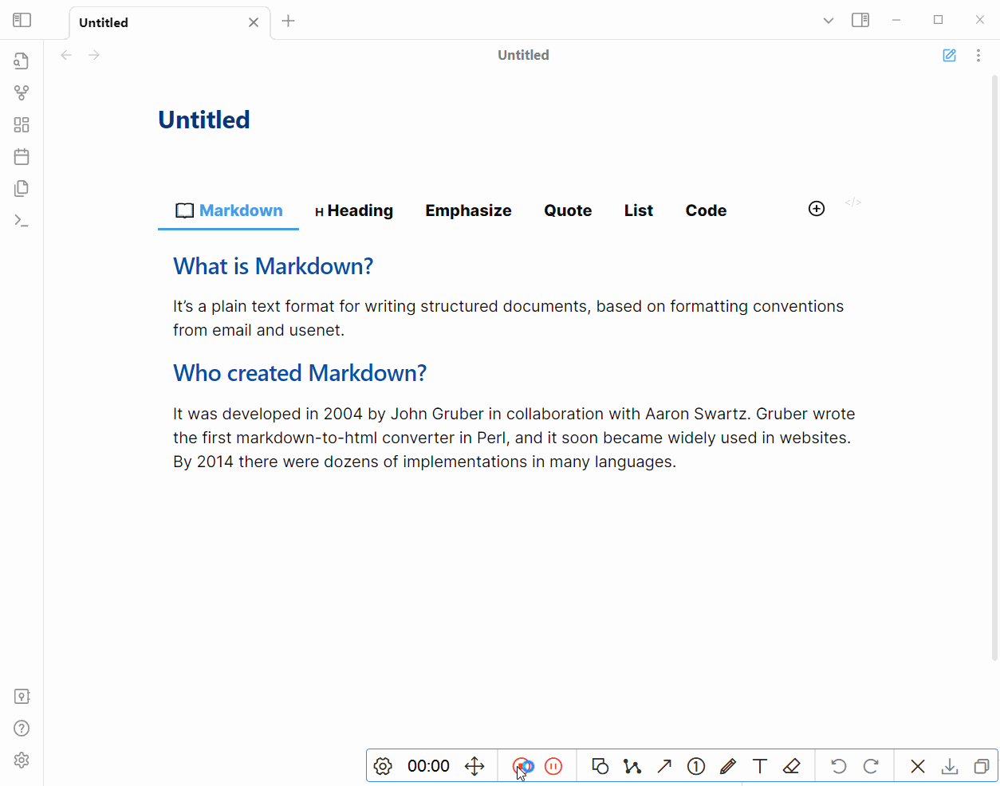
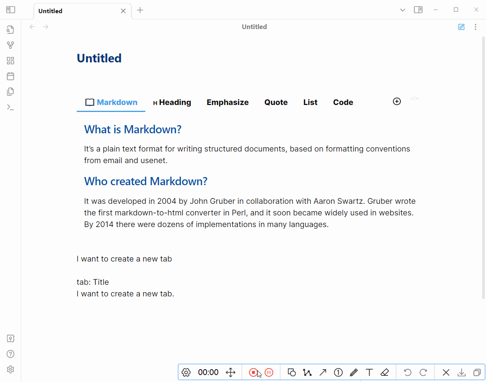

# 快捷菜单

右键 Tabs 组件的 nav 部分会出现一个快捷菜单，这个菜单提供了四个功能：

- Add new tab: 新建 tab
- Delete tab: 删除右键的 tab
- Copy tab: 复制右键的 tab
- Paste tab: 新建 tab，并且将剪切板中的内容粘贴到该 tab 中
  - 当剪切板中的内容以分隔符（默认为 `tab: `）开头时，会将剪切板中的内容解析为 title 和 content

