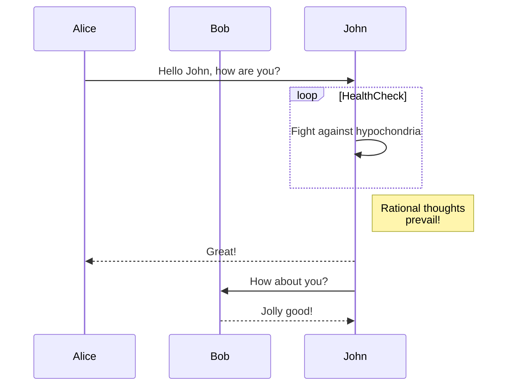
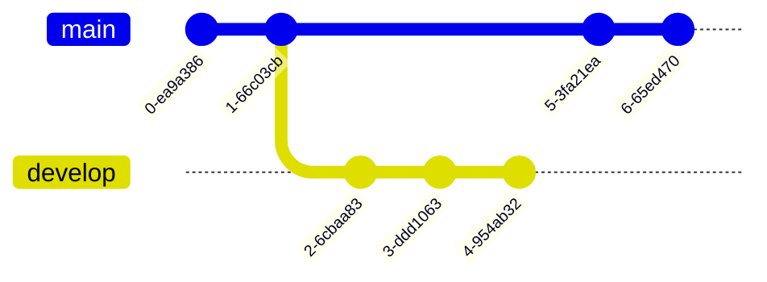
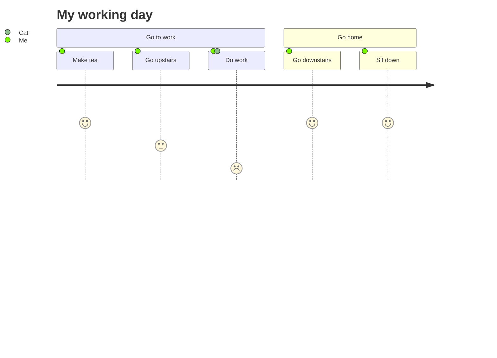
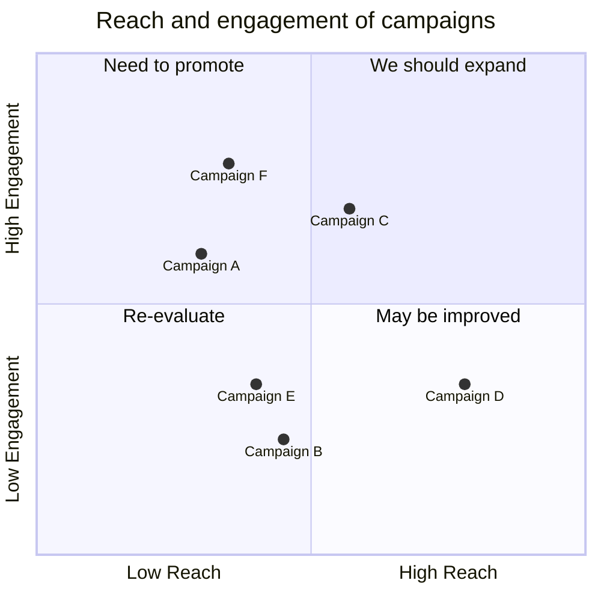
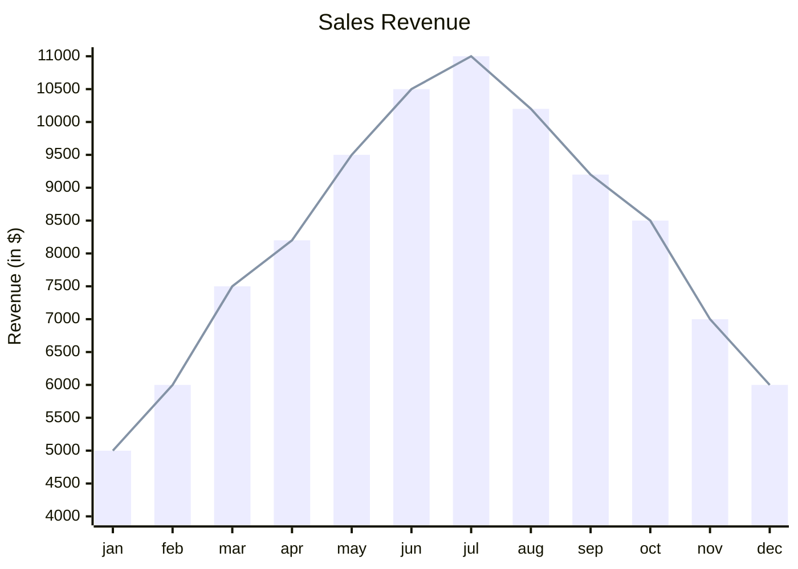

# 搭配其他插件使用

tab content 使用 [`MarkdownRenderer.render()`](https://docs.obsidian.md/Reference/TypeScript+API/MarkdownRenderer/render#MarkdownRenderer.render()+method) 渲染，即使用的是 ob 的阅读模式渲染，因此能够与许多插件搭配着使用。

::: details Markdown 嵌套使用代码块

Markdown 有两种嵌套使用代码块的格式：

只用一种反引号时，外层代码块使用反引号的个数必须多于内层代码块使用的反引号个数

`````
````tabs
tab: python
```python
print("Hello Tabs")
```

tab: javascript
```javascript
console.log('Hello Tabs');
````
`````


同时使用两种反引号生成代码块时，只需要同种反引号保持外层多于内层即可

````
~~~tabs
tab: python
```python
print("Hello Tabs")
```

tab: javascript
```javascript
console.log('Hello Tabs');
```
~~~
````

:::

## With Dataview & Tasks


From [DeusEx01](https://github.com/xhuajin/obsidian-tabs/issues/28)

## With mermaid


::: details 源码

`````md
````tabs

tab: <span style="color: transparent; background:-webkit-linear-gradient(120deg, #bd34fe 30%, #ff3670); -webkit-background-clip: text; -webkit-text-fill-color: transparent;">Mermaid</span>
Mermaid 允许你使用文本和代码创建图表和可视化。

它是一个基于 JavaScript 的图表绘制工具，可渲染 Markdown 启发的文本定义以动态创建和修改图表。
tab: 流程图

tab: 时序图

tab: Git 图

tab: 用户旅程图

tab: 象限图

tab: XY图表

````
`````

:::
